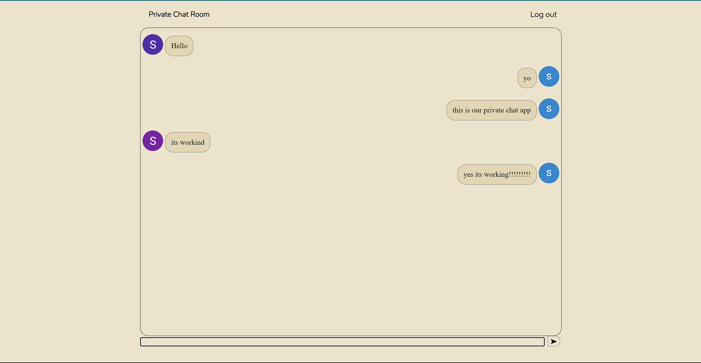

# Chat-App

This a very basic chat app.



To use this App, Click this link --> chatapp-video-c5a96.web.app

## Running Locally

1. Download the source code by clicking the '<> Code' option then clicking download zip.

2. Extract the zip folder and open it in VSCode.
 
3. Open a new terminal, Then change the directory to the folder you just downloaded.
To change the directory, type this command in the terminal
```
cd Chat-App-main
```

4. Next,step is to install the required node modules.
To do that, Type the following command shown below
```
npm i
```

5. Run the app locally.
```
npm start
```